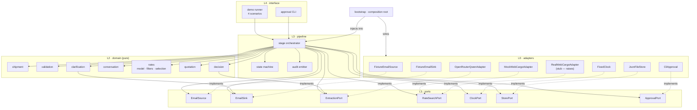
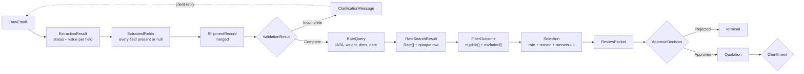
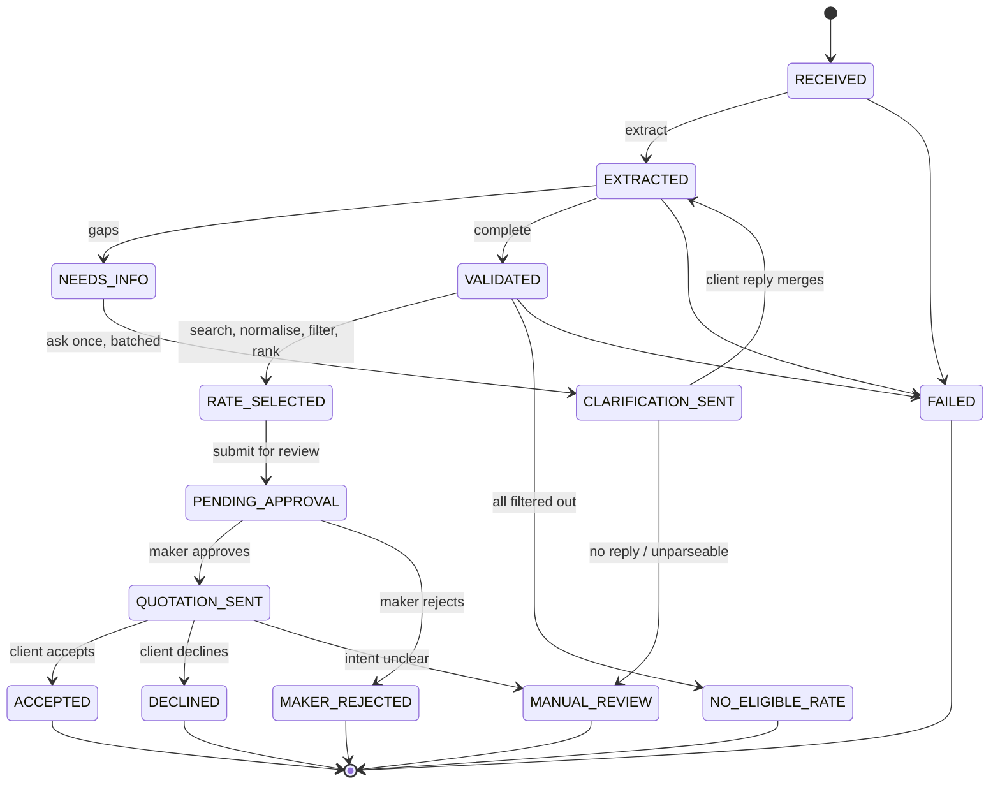

# Architecture — AI-Assisted Cargo Quotation Demo

**Design status:** Frozen during Phase 0. Unchanged since.
**Implementation status:** Phases 1-5 implemented. Phase 6 next. See §17.
**Scope:** Demonstration / proof of concept. Not the production system.
**Supersedes:** nothing. This is the first architecture document in the repository.

---

## 1. What this document is for

This describes the internal structure of the demo: the modules, what each one owns,
which direction dependencies point, and where the system is allowed to fail.

It is deliberately narrower than the source specification. The demo proves the
business workflow — email in, one fastest eligible rate out, a human approving
before anything reaches the client. It is not a production integration, and several
production concerns are named here only as extension points so that nobody has to
guess later whether their absence was an oversight or a decision.

Three things are out of scope and must not appear in the codebase: a frontend, any
authentication, and automatic booking.

### Design decision vs. implementation status

This document records **architecture and design decisions**, which were frozen
during Phase 0 and have not been revised since. It is written in the present
tense throughout — "the port returns normalised rates", "filtering never scores" —
and that tense describes *the design*, not what is built.

Phases 1-5 have been implemented incrementally without abandoning any of those
boundaries. Where a section below describes a component that does not exist yet,
the design still stands; only the code is absent. **§17 is the single place this
document states what is actually built.** Nothing else here should be read as an
implementation claim.

The design is not revised merely because implementation has advanced, and it is
not revised to match code that drifted. Where the two genuinely disagree, that is
a defect in one of them and is recorded, not quietly reconciled.

---

## 2. Architectural principle

**This is a modular monolith. One process, one deployable, one language runtime.**

There are no services, no queues, no network hops between modules, no
inter-process serialisation. A module boundary here is a *compile-time and
review-time* boundary, enforced by import rules and dependency direction — not by
a network.

The goal is that a reader can find where a behaviour lives in one guess, and that a
future production build can replace an adapter without touching business logic.
Distribution would buy nothing at this size and would cost the ability to run the
whole workflow in a single test.

Concretely, the following are architectural errors in this codebase:

- A module that reaches around a port to import an adapter directly.
- A business rule expressed inside an adapter.
- A function that performs more than one stage of the rate pipeline.
- An `if mock:` branch anywhere outside the composition root.
- A model call on any path other than extraction and client-intent reading.

---

## 3. Decision record

### AMB-1 — Transit time (resolved for the demo)

> **Real WebCargo transit-time source must be verified before production
> implementation. Demo transit times are supplied by the mock adapter.**

Consequences, which the rest of this document is built on:

1. `transit` is a first-class field on the internal normalised `Rate` model.
2. `MockWebCargoAdapter` supplies deterministic transit values from fixtures.
3. Fastest eligible transit remains the primary selection criterion (BR-1).
4. Mock fixtures **must** include cases where the fastest rate costs more than a
   slower one, so that selection cannot pass by accidentally ranking on price.
5. Rate selection operates only on the normalised `Rate` model. It has no way to
   discover whether the data came from the mock or the real adapter, and no code
   path that could branch on it.
6. The real adapter does **not** invent a transit source.
7. No WebCargo field is assumed to carry transit time.
8. `RealRateMapper` leaves transit-time mapping explicitly unresolved. It is an
   executable blocker, not a comment — see §12.

The demo is not blocked by this. Everything downstream of normalisation is fully
implementable today.

### AMB-14 — Language and stack (resolved in Phase 1)

Python with pydantic for schemas, pytest for tests, mypy in strict mode and ruff
for lint and format. The layer model was stack-independent and remains so; the
contract sketches in §6 are now backed by real Python of the same shape.

### Decisions still open that affect structure

| Ref | Question | How the architecture absorbs it |
|---|---|---|
| AMB-3 | Carrier restriction rules and their input data | Restrictions are a config-driven filter over a `RateRestrictions` value on the `Rate` model. Changing the rule set is a config edit. |
| AMB-4 | Does client rejection loop back to selection? | The state machine treats `DECLINED` as terminal, with the loop edge specified but not wired. Adding it is one transition. |
| AMB-8 | Where `RateQuery.date` comes from | Nothing produces it yet. Not defaulted to today, tomorrow, next available, shipment date or quote date — no approved document specifies a rule. **Blocking for Phase 8.** |
| AMB-11 | Thread correlation strategy | Correlation is a named policy object behind an interface, not inline logic. |

---

## 4. Layer model and the dependency rule

Five layers. **Dependencies point downward and inward only.**

```
┌──────────────────────────────────────────────────────────────┐
│ L4  interface/        demo runner, CLI entry points          │
│                       knows everything, is known by nothing   │
├──────────────────────────────────────────────────────────────┤
│ L3  pipeline/         orchestration, stage sequencing,        │
│                       state machine, audit emission           │
├──────────────────────────────────────────────────────────────┤
│ L2  domain/           shipment, validation, clarification,    │
│                       rates, quotation, decision — PURE       │
├──────────────────────────────────────────────────────────────┤
│ L1  ports/            interfaces owned by L2 and L3           │
├──────────────────────────────────────────────────────────────┤
│ L0  adapters/         openrouter, webcargo, email, clock,     │
│                       store — implement L1                    │
└──────────────────────────────────────────────────────────────┘

        adapters ──implements──▶ ports ◀──depends on── domain
                                   ▲
                                   └──depends on── pipeline

        bootstrap.py (composition root) is the ONLY place that
        names a concrete adapter class.
```

### The dependency rule, stated as prohibitions

Business logic must not depend on:

| Forbidden dependency | Where it is allowed instead |
|---|---|
| OpenRouter SDK / HTTP details | `adapters/extraction/openrouter/` only |
| Qwen prompt, model id, token handling | `adapters/extraction/openrouter/` only |
| Gmail / IMAP / SMTP | `adapters/email/` only |
| WebCargo request shape, response shape, session, endpoints | `adapters/webcargo/` only |
| CLI parsing, stdout formatting, exit codes | `interface/` only |
| Wall-clock time, random numbers, filesystem paths | `adapters/clock/`, `adapters/store/` only |

`domain/` imports nothing but `domain/`, `ports/`, and standard library. That single
rule is the one worth enforcing mechanically in CI, because every other boundary
violation tends to show up as a breach of it.

### Enforcement

An import-linter contract per layer, run in CI. Four rules:

1. `domain` may not import `adapters`, `pipeline`, `interface`, or `config`.
2. `pipeline` may not import `adapters` or `interface`.
3. `adapters` may not import `pipeline` or `interface`.
4. Only `bootstrap` may import a concrete adapter class.

Rule 4 is what keeps the mock strategy honest. Without it, "swap the adapter"
degrades into a flag check somewhere in the middle of the pipeline.

---

## 5. Component diagram



Solid arrows are compile-time dependencies. Dotted arrows are implementations —
note that they point *up* into `ports`, which is what inverts the dependency and
keeps `domain` free of infrastructure.

---

## 6. Module responsibilities

Sixteen modules. For each: what it owns, what it may depend on, and — usually more
useful during review — what it must never do.

### 6.1 Email ingestion

| | |
|---|---|
| **Layer** | L0 adapter + L1 port + L3 stage |
| **Owns** | `EmailSource` port; `FixtureEmailSource`; the `RawEmail` DTO |
| **Depends on** | nothing above L1 |
| **Never** | parses cargo fields, calls a model, or decides anything about a shipment |

Yields `RawEmail { message_id, in_reply_to, references, from_address, subject, body_text, received_at }`.
Ingestion understands mail, not cargo. The single most common way this module goes
wrong is absorbing "a bit of" extraction because a regex was easier than a model
call — that belongs in §6.2 or nowhere.

### 6.2 AI extraction

| | |
|---|---|
| **Layer** | L0 adapter + L1 port |
| **Owns** | `ExtractionPort`; `OpenRouterQwenAdapter`; the prompt; strict schema binding |
| **Depends on** | `ports`, `domain/shipment` types only |
| **Never** | validates, ranks, approves, sends, or fills a field the email did not state |

**The only module in the system that calls a language model**, alongside §6.12
which reuses the same port. Contract:

```
ExtractionPort.extract_shipment(text: str) -> ExtractionResult
```

`ExtractionResult` carries every canonical field as an `ExtractedValue` — a
status, an optional value, the evidence it came from, and a note. The status
distinguishes four situations a single null cannot: the email was silent, the
client explicitly denied the field, the email said something unrepresentable, or
the value is genuinely stated.

`domain.extraction.to_extracted_fields` narrows that into `ExtractedFields`,
where a field is present or explicitly null and nothing else. That narrowing is
lossy and documented as such — see `docs/extraction-contract.md` §8.

A response that does not satisfy the schema is a `ContractViolation`, never a
partial parse.

> **Phase 4 refinement.** This port originally returned `ExtractedFields`
> directly. It was widened to `ExtractionResult` when the extraction contract was
> designed, because collapsing "the client said no" into the same null as "the
> email was silent" loses information a clarification step needs. No
> implementation existed at the time, so nothing broke. The canonical
> `ShipmentRecord` and `ExtractedFields` were **not** changed.

The model id lives in config (AMB-2), the prompt lives in this adapter, and neither
is visible to any other module.

### 6.3 Shipment domain

| | |
|---|---|
| **Layer** | L2, pure |
| **Owns** | `ShipmentRecord`; the merge function; field value objects |
| **Depends on** | standard library only |
| **Never** | performs I/O, reads a clock, or knows what a rate is |

`ShipmentRecord` is exactly the specification's shape: `request_id`, `source`,
`origin`, `destination`, `weight_kg`, `dimensions_in {length, width, height}`,
`commodity`, `cargo_type`, `is_chemical`, `msds_attached`, `pcs`, `delivery_type`,
`delivery_address`. No fields added.

The merge function implements BR-8 and is the subtlest code in the module:

```
merge_shipment(existing: ShipmentRecord, incoming: ExtractedFields) -> MergeResult
MergeResult = { record, changed[], unchanged[], conflicts[] }
FieldConflict = { field, existing_value, new_value }
```

It fills nulls and never overwrites a known value with a null. A later reply that
mentions only commodity and piece count must leave the other nine fields untouched.

Three rules, applied independently per field:

| Existing | Incoming | Result |
|---|---|---|
| missing | present | fill → `changed` |
| present | identical | retain → `unchanged` |
| present | different | **conflict** → `conflicts`; record unmodified |

The conflict rule extends the Phase 0 design rather than contradicting it. Phase 0
said a known value is never overwritten by a null; Phase 2's approved requirement
added that a known value is never overwritten by a *contradicting value* either.
Both are the same principle — the merge does not discard information on its own.

Retaining the existing value on a conflict is not a resolution. The merge makes no
claim that the older value is correct, and **no conflict-resolution policy exists
or has been specified**; resolving a conflict is a future workflow responsibility,
and `FieldConflict` carries both values so that layer has what it needs.

`cargo_type` and `is_chemical` are independent fields (BR-12). The type system
should make it impossible to derive one from the other.

### 6.4 Validation

| | |
|---|---|
| **Layer** | L2, pure |
| **Owns** | the eleven required-field rules; `ValidationResult` |
| **Depends on** | `domain/shipment` |
| **Never** | sends anything, phrases a question, or knows about rates |

```
validate_shipment(record: ShipmentRecord) -> ValidationResult
ValidationResult   = { issues[] }
ValidationIssue    = { rule_id, field, severity, message }
ValidationSeverity = MISSING | INVALID | WARNING
```

with derived views `is_valid`, `missing_fields`, `invalid_fields`, `warnings`.

Every issue carries a stable machine-readable `rule_id`, so a caller can group,
filter or route on the rule without parsing a message string — which is what lets
a later phase build one batched clarification from one result. The validator
reports *every* applicable failure in one pass; it never stops at the first.

`WARNING` is supported by the result type but **no rule produces one today**. It
exists so a future non-blocking rule needs no redesign. A result carrying only
warnings is still `is_valid`.

Nine unconditional rules, two conditional: `msds_attached` required only when
`is_chemical` is true; `delivery_address` required only when `delivery_type` is
`"door"`. Each rule is a separate named predicate so that a failing test points at
one rule rather than at a boolean expression.

Eleven business rules, thirteen `ValidationRuleId` values: weight and pieces each
carry a separate identifier for their `INVALID` case (`WEIGHT_INVALID`,
`PCS_INVALID`), so "absent" and "present but nonsensical" are distinguishable.
There is no `DIMENSIONS_INVALID` — `CargoDimensions` enforces positivity at
construction, so the validator only ever sees dimensions present or absent.

Validation is deterministic and **never calls a language model**. It does not
mutate the record, and it does not raise — an incomplete shipment is a normal
business outcome, not an error (§12).

### 6.5 Clarification

| | |
|---|---|
| **Layer** | L2 composer + L3 stage |
| **Owns** | `ClarificationComposer`; the message template |
| **Depends on** | `domain/validation`, `ports/EmailSink` |
| **Never** | calls a model to write prose |

```
compose(missing: list[FieldName], record: ShipmentRecord) -> ClarificationMessage
```

Deterministic templating. One batched message covering every gap (BR-9) — the
composer takes the whole missing list and has no single-field entry point, so
"ask one thing at a time" is not expressible.

Outbound copy is templated rather than generated because it is customer-facing and
must be reviewable, diffable, and identical across runs.

### 6.6 Conversation / thread management

| | |
|---|---|
| **Layer** | L2 + L3 |
| **Owns** | `Thread`; `CorrelationPolicy`; the request↔thread index |
| **Depends on** | `domain/shipment` |
| **Never** | parses cargo fields |

Answers one question: *does this email belong to a request we already have?*

```
CorrelationPolicy.correlate(email: RawEmail, index: ThreadIndex) -> RequestId | New
```

The default policy walks `In-Reply-To` and `References`, falling back to sender plus
normalised subject. It is a named policy object because the strategy is unconfirmed
(AMB-11) and because the real thread's subject line accumulated four concatenated
titles across three days — subject matching alone would be unsafe.

Correlation failure is not silent. An email that cannot be placed becomes a new
request or goes to `MANUAL_REVIEW`; it never merges into a guess.

### 6.7 WebCargo integration

| | |
|---|---|
| **Layer** | L0 adapter + L1 port |
| **Owns** | `RateSearchPort`; `MockWebCargoAdapter`; `RealWebCargoAdapter`; both rate mappers |
| **Depends on** | `ports`, `domain/rates/model` |
| **Never** | filters, ranks, or lets its wire format escape |

```
RateSearchPort.search(query: RateQuery) -> RateSearchResult

RateQuery       = { origin_iata, destination_iata, weight_kg, dimensions_in, date }
RateSearchResult = { rates: list[Rate], raw_payload: Opaque, adapter_id: str }
```

Two deliberate design choices:

**The port returns normalised `Rate` objects, not raw ones.** Raw responses never
cross the boundary as domain data. This is what makes AMB-1 consequence 5 structural:
selection has no access to anything adapter-shaped, so it cannot branch on provenance
even by accident.

**`raw_payload` is opaque and audit-only.** It is written to the audit trail so a
run can be reconstructed, and it is typed such that no domain module can read a
field out of it. Raw → normalised remains a visible, separately-recorded stage
(§9) without becoming a leak.

Identity: WebCargo has exactly one user, Translog. No client identity or credential
reaches this module (BR-13). The `RateQuery` type has no field capable of carrying
one.

### 6.8 Rate normalization

| | |
|---|---|
| **Layer** | L0, adapter-owned, separately testable |
| **Owns** | `MockRateMapper`; `RealRateMapper` |
| **Depends on** | `domain/rates/model` |
| **Never** | drops a rate, scores a rate, or reorders rates |

Each adapter has its own mapper as a distinct component with its own tests. A mapper
translates one wire shape into `Rate` and does nothing else. Normalisation that
silently discards unmappable rows would hide exactly the problems this stage exists
to surface, so a row that cannot be mapped becomes a `Rate` with null fields and is
excluded later, by a filter, with a reason.

`RealRateMapper` maps only confirmed fields. Its transit mapping is an explicit
unresolved dependency (§12, AMB-1 consequences 6–8).

### 6.9 Rate filtering

| | |
|---|---|
| **Layer** | L2, pure |
| **Owns** | the filter predicates; `FilterOutcome` |
| **Depends on** | `domain/rates/model`, `domain/shipment` |
| **Never** | scores, ranks, or reorders |

Hard pass only, no judgement (BR-6). Each filter is an independent predicate that
returns an exclusion *reason*, because the quotation maker's review view has to show
why a carrier is absent — silence there is indistinguishable from a bug.

| Filter | Rule | Source |
|---|---|---|
| `DropIncompleteRate` | null total or currency | BR-4 |
| `DropUnrankableRate` | null transit — cannot be ranked under BR-1 | consequence of AMB-1 |
| `DropRestrictedCarrier` | carrier cannot carry this cargo | BR-5 · governed by AMB-3 |

`DropUnrankableRate` deserves a note. Because transit is the primary key, a rate
without transit is not merely unattractive — it is unrankable. Excluding it silently
would let a real-adapter integration gap masquerade as a thin market. So the
exclusion is recorded per rate, and when *every* rate is excluded for this reason the
pipeline reaches `NO_ELIGIBLE_RATE` with a distinct cause that names the mapping
problem rather than the market.

### 6.10 Rate selection

| | |
|---|---|
| **Layer** | L2, pure |
| **Owns** | `RateSelector`; the comparator chain; `Selection` |
| **Depends on** | `domain/rates/model`, `config` schema (values injected, not read) |
| **Never** | excludes a rate, calls a model, or reads adapter data |

```
select(eligible: list[Rate], strategy: SelectionStrategy) -> Selection | NoneEligible
Selection = { rate: Rate, reason: str, runners_up: list[Rate] }
```

The strategy is an ordered list of comparison keys, supplied from config (BR-3):

```yaml
selection:
  strategy: fastest_eligible
  keys:
    - { field: transit,      order: asc }   # BR-1 primary
    - { field: total_amount, order: asc }   # BR-2 tie-break
    - { field: carrier_code, order: asc }   # determinism, never a business rule
```

Switching the business to lowest-price is a reordering of `keys`. No code changes,
which is the whole point of BR-3. The third key exists solely so two identical
offers always produce the same winner across runs.

`reason` is generated from the winning comparison, not written by hand, so the
explanation shown to the quotation maker cannot drift from the logic that produced it.

### 6.11 Quotation workflow

| | |
|---|---|
| **Layer** | L2 + L3 |
| **Owns** | `Quotation`; `QuotationComposer`; the approval gate |
| **Depends on** | `domain/rates`, `domain/shipment`, `ports/ApprovalPort`, `ports/EmailSink` |
| **Never** | sends without an approval record |

The gate is the architecturally important part. It is modelled as a **halt**, not a
callback and not a timeout:

```
ApprovalPort.request(review: ReviewPacket) -> ApprovalDecision
ApprovalDecision = Approved(by, at) | Rejected(by, at, reason)
```

The pipeline enters `PENDING_APPROVAL` and stops. There is no elapsed-time path from
`PENDING_APPROVAL` to `QUOTATION_SENT` (BR-11). Resuming requires an explicit
`ApprovalDecision`, and the send function takes that decision as a required argument
— so "send without approval" is not a code path that exists to be tested, it is a
signature that cannot be called.

`ReviewPacket` is what the quotation maker sees: the extracted record, the missing
fields, clarification status, every rate with its exclusion reason, and the
recommendation with its generated reason.

### 6.12 Client response handling

| | |
|---|---|
| **Layer** | L2 + L1 |
| **Owns** | `IntentReader`; `ClientIntent` |
| **Depends on** | `ports/ExtractionPort` |
| **Never** | decides what happens next |

```
read_intent(reply_text: str) -> ACCEPT | DECLINE | UNCLEAR
```

The boundary drawn here (AMB-10): the model *reports what the client said*; the state
machine *decides what follows*. `UNCLEAR` routes to `MANUAL_REVIEW` — there is no
default, in either direction, because defaulting an ambiguous reply to acceptance is
a commercial act and defaulting it to rejection loses business.

### 6.13 Demo runner

| | |
|---|---|
| **Layer** | L4 |
| **Owns** | the four scenario scripts and their assertions |
| **Depends on** | `bootstrap`, `pipeline` |
| **Never** | contains business rules |

Each scenario is a script *and* an assertion over the resulting state and audit
trail — an executable specification, not a manual walkthrough. A scenario that stops
passing is a failing test, which is what keeps the demo honest as the code changes.

| Scenario | Proves |
|---|---|
| S1 complete → quotation → accept | happy path, both human gates |
| S2 incomplete → clarification → reply → quotation | BR-8 merge, BR-9 batching, the loop |
| S3 many rates → filtering → fastest eligible | BR-1, BR-2, BR-4, BR-5, BR-6 |
| S4 quotation → rejection | terminal `DECLINED` (AMB-4) |

### 6.14 Configuration

| | |
|---|---|
| **Layer** | cross-cutting, read at bootstrap |
| **Owns** | typed settings; the business-rule values |
| **Depends on** | nothing |
| **Never** | is read from inside `domain` |

Config is loaded once at the composition root and **injected as values**. Domain
modules receive a `SelectionStrategy`, not a config object — so no business rule can
be reached by importing a settings singleton, and every rule is visible in a function
signature.

Holds: selection strategy and keys, filter enable/parameters, model id (AMB-2),
adapter selection, fixture paths, retry bounds. Secrets come from the environment
and are never committed; `.env.example` documents the names.

### 6.15 Logging

| | |
|---|---|
| **Layer** | cross-cutting |
| **Owns** | structured application log; append-only audit trail |
| **Depends on** | nothing |
| **Never** | logs a secret, a credential, or a raw API key |

Two distinct streams, and conflating them is a common mistake worth naming:

**Application log** — diagnostics for a developer. Freeform, discardable.

**Audit trail** — append-only, per request, the evidence that the workflow ran as
designed. Every state transition, every model call with its request and response,
every rate set at every pipeline stage, every filter exclusion with its reason, every
human action with who and when. The audit trail is a *deliverable* of the demo: it is
how a stakeholder verifies that the AI did not decide anything it was not supposed to.

### 6.16 Testing

| | |
|---|---|
| **Layer** | cross-cutting |
| **Owns** | three test tiers |
| **Depends on** | everything |

| Tier | Covers | Network |
|---|---|---|
| **Unit** | pure domain — merge, the eleven rules, each filter, the comparator chain | never |
| **Contract** | one shared suite run against *every* implementation of a port | never |
| **Scenario** | the four demos end to end through `bootstrap` | never |

The contract tier is the load-bearing one. A single suite defines what
`RateSearchPort` means and runs against the mock today and the real adapter later —
so the mock cannot drift into being easier to satisfy than reality. Failing that,
"we swapped in the real adapter and everything broke" is discovered at integration
time instead of at design time.

---

## 7. Dependency direction

Restated as a single table, because this is the rule most likely to erode.

| From ↓ / May import → | domain | ports | pipeline | adapters | config | interface |
|---|:---:|:---:|:---:|:---:|:---:|:---:|
| **domain** | ✅ | ✅ | ❌ | ❌ | ❌ | ❌ |
| **ports** | ✅ | ✅ | ❌ | ❌ | ❌ | ❌ |
| **pipeline** | ✅ | ✅ | ✅ | ❌ | ❌ | ❌ |
| **adapters** | ✅ | ✅ | ❌ | ✅ | ❌ | ❌ |
| **interface** | ✅ | ✅ | ✅ | ❌ | ✅ | ✅ |
| **bootstrap** | ✅ | ✅ | ✅ | ✅ | ✅ | ❌ |

`bootstrap` is the single exception that makes the rest work: exactly one file names
concrete adapter classes, and it is the file you read to learn how the system is
assembled.

---

## 8. Data flow



Each arrow is a type change, and each type is owned by exactly one module. Types do
not gain fields as they travel; a stage that needs more information takes a second
argument rather than widening the type it was handed.

| Stage | In | Out | Owner |
|---|---|---|---|
| Ingest | fixture file | `RawEmail` | §6.1 |
| Correlate | `RawEmail` + index | `RequestId` \| New | §6.6 |
| Extract | `RawEmail.body_text` | `ExtractionResult` | §6.2 |
| Narrow | `ExtractionResult` | `ExtractedFields` | §6.2 |
| Merge | `ExtractedFields` + prior | `ShipmentRecord` | §6.3 |
| Validate | `ShipmentRecord` | `ValidationResult` | §6.4 |
| Compose clarification | missing fields | `ClarificationMessage` | §6.5 |
| Resolve route | origin/destination | IATA codes | §6.7 helper |
| Search | `RateQuery` | `RateSearchResult` | §6.7 |
| Normalise | wire payload | `Rate[]` | §6.8 |
| Filter | `Rate[]` + `ShipmentRecord` | `FilterOutcome` | §6.9 |
| Select | eligible `Rate[]` + strategy | `Selection` | §6.10 |
| Compose quotation | `Selection` + record + approval | `Quotation` | §6.11 |
| Read intent | reply text | `ClientIntent` | §6.12 |

---

## 9. The rate pipeline

**Four stages. Four types. Four components. Four audit entries. Never one function.**

```
   ┌─────────────────┐
   │   RAW RATES     │  adapter-internal, opaque beyond the port
   │  wire payload   │  audit-visible, domain-unreadable
   └────────┬────────┘
            │  RateMapper            §6.8  — translate only
            ▼
   ┌─────────────────┐
   │ NORMALIZED      │  list[Rate]
   │ RATES           │  provenance-free, adapter-agnostic
   └────────┬────────┘
            │  FilterChain           §6.9  — exclude only, with reasons
            ▼
   ┌─────────────────┐
   │ FILTERED RATES  │  FilterOutcome { eligible[], excluded[] }
   └────────┬────────┘
            │  RateSelector          §6.10 — order only, never exclude
            ▼
   ┌─────────────────┐
   │ SELECTED RATE   │  Selection { rate, reason, runners_up }
   └─────────────────┘
```

The separation is not stylistic. Each stage has a property the others must not have:

- **Mapping** may change shape, never membership. A mapper that drops rows hides
  integration gaps.
- **Filtering** may change membership, never order, and never scores.
- **Selection** may change order, never membership.

Any function that does two of these can no longer be tested for the property it is
supposed to preserve, which is why they are separate components rather than steps
inside one call.

### The normalised `Rate` model

```
Rate:
    carrier_code:  str          # e.g. "EK"
    carrier_name:  str
    product:       str          # e.g. "GEN"
    total_amount:  Decimal | None
    currency:      str | None
    transit:       TransitTime | None      # AMB-1
    restrictions:  RateRestrictions        # AMB-3
    source_ref:    str          # adapter's opaque id, audit only

TransitTime:
    value: int
    unit:  DAYS | HOURS         # explicit — never a bare number
```

`transit` is nullable at the type level and that nullability is deliberate: it is how
the real adapter's unresolved mapping (§12) travels through the system as data rather
than as a crash, while `DropUnrankableRate` guarantees it can never reach selection.

`TransitTime` carries its unit because "2" meaning days and "2" meaning hours differ
by a factor of twelve in the ranking, and a bare integer makes that a silent bug.

---

## 10. State transitions



Twelve states. Six terminal. One loop in scope: `CLARIFICATION_SENT → EXTRACTED`,
which a request may traverse any number of times while information is missing.

Two properties the state machine enforces structurally rather than by convention:

- **`PENDING_APPROVAL` has no automatic exit.** No timer, no default, no retry
  escalation. The only transitions out require an `ApprovalDecision` (BR-11).
- **Illegal transitions raise.** The transition table is data, and an attempt to move
  between two states not in it is a programming error that fails loudly rather than
  a state that silently does not change.

`DECLINED` is terminal pending AMB-4. If the specification's next-best loop is
confirmed, it becomes one additional edge `DECLINED → RATE_SELECTED` with an
exclusion set and a repeat cap — the surrounding design does not change.

---

## 11. External integration boundaries

Four boundaries. Each is a port with at least one adapter, and each one is the *only*
place its technology appears.

| Boundary | Port | Demo adapter | Production adapter | Blocked by |
|---|---|---|---|---|
| Language model | `ExtractionPort` | `OpenRouterQwenAdapter` + response cache | same | AMB-2 (model id) |
| Rate search | `RateSearchPort` | `MockWebCargoAdapter` | `RealWebCargoAdapter` — stub | AMB-1, AMB-3 |
| Inbound mail | `EmailSource` | `FixtureEmailSource` | `GmailEmailSource` — not built | — |
| Outbound mail | `EmailSink` | `FixtureEmailSink` → outbox dir | SMTP/Gmail — not built | — |

Three supporting ports exist for determinism rather than integration: `ClockPort`
(no module reads wall-clock time directly), `StorePort` (in-memory + JSON snapshots),
and `ApprovalPort` (CLI in the demo, a UI later).

**What crosses each boundary is a domain type, not a wire type.** `ExtractionPort`
returns `ExtractedFields`, not a chat-completion object. `RateSearchPort` returns
`Rate` objects, not a WebCargo response. This is what allows the real adapters to be
written later without a single change inside `domain/`.

**No undocumented endpoint or credential is written anywhere.** `RealWebCargoAdapter`
exists as a stub that raises, and the session/token lifecycle the specification
describes (AMB-16) is deferred to it entirely.

---

## 12. Failure boundaries

### Failures and outcomes are different things

The distinction that keeps error handling sane here:

| Kind | Examples | Mechanism |
|---|---|---|
| **Business outcome** | shipment incomplete · no eligible rates · maker rejects · client declines | a **result type** and a state transition — never an exception |
| **Infrastructure failure** | network error, 5xx, timeout, rate limit | typed error at the adapter boundary, bounded retry |
| **Contract violation** | model returns unparseable output, unmapped required field, illegal state transition | raise loudly, transition to `FAILED`, no recovery attempt |

An incomplete shipment is the workflow working correctly. Modelling it as an
exception is the fastest way to end up with a `try/except` that swallows a real
integration fault alongside it.

### Where each boundary sits

**Adapter boundary — the primary one.** Every adapter translates its native errors
into port-level errors. `httpx.HTTPError`, `openai.APIError`, and their equivalents
must not escape `adapters/`. Retries live here, are bounded, apply only to transient
classes, and are logged with attempt counts.

**Model output boundary.** Extraction output is schema-validated at the adapter edge.
A malformed response is a `ContractViolation`, never a partial parse (A-11) — half a
shipment record is more dangerous than none, because validation would pass it.

**Mapping boundary — where AMB-1 lives.** `RealRateMapper` does not guess:

```
class RealRateMapper:
    def map_transit(self, row) -> TransitTime:
        raise UnresolvedFieldMapping(
            "WebCargo transit-time source is unverified. "
            "See docs/architecture.md §3, AMB-1."
        )
```

This is the blocker made executable. Anyone wiring the real adapter hits a named
error pointing at this document, rather than shipping a plausible wrong field. The
mock is unaffected, and the demo runs.

**State machine boundary.** Illegal transitions raise. The transition table is the
authority on what may happen, and code that disagrees with it is wrong.

**Human boundaries — halts, not failures.** `PENDING_APPROVAL` and `QUOTATION_SENT`
are waiting states, not stalled ones. No timeout advances them. `MANUAL_REVIEW` is
where genuinely ambiguous situations go, and it is a terminal state for the demo
because "a person picks it up" is outside what the demo automates.

**Per-request isolation.** A failure fails one request. The pipeline processes
requests independently, and one bad email cannot take down a scenario run.

---

## 13. Mock strategy

### The rule

**A mock is a peer implementation of a port, not a mode of the real one.** There is
no `if mock:` branch, no `use_mock` flag read below the composition root, and no
subclass relationship between mock and real. `bootstrap` selects one; nothing
downstream can tell which it got.

That is what makes AMB-1 consequence 5 true by construction rather than by discipline.

### Three fixture layers

| Layer | Adapter | Fixture |
|---|---|---|
| Inbound mail | `FixtureEmailSource` | `.eml`-style files per scenario, synthetic identities (A-10) |
| Model | `OpenRouterQwenAdapter` + cache | recorded responses keyed by input hash |
| Rates | `MockWebCargoAdapter` | JSON rate sets per scenario |

The model cache is a recording, not a hand-written stub: the first run records a real
OpenRouter response, subsequent runs replay it. So the demo is offline and
deterministic (A-12) while the recorded response is genuinely what the model returned.

### Determinism

Demos that drift are not demonstrations. Four sources of nondeterminism are closed:

1. **Time** — `ClockPort`, `FixedClock` in demos. No module reads the clock directly.
2. **Randomness** — none. Request ids are fixture-assigned.
3. **Model output** — cached responses.
4. **Ordering** — the comparator chain's third key (`carrier_code`) guarantees a
   stable winner among otherwise-identical offers.

### The Scenario 3 fixture

This fixture is where AMB-1 consequence 4 becomes a test. It must be built so that
ranking on price produces the wrong answer:

| Carrier | Total (INR) | Transit | Outcome |
|---|---|---|---|
| *(restricted carrier)* | 16,900.00 | 1 day | **excluded** — carrier restriction (BR-5). Fastest *and* cheapest. |
| SriLankan | 17,200.00 | `null` | **excluded** — unrankable, no transit |
| Uzbekistan | `null` | 3 days | **excluded** — missing rate data (BR-4) |
| Etihad | 18,340.00 | 4 days | eligible, cheapest survivor |
| Qatar | 19,880.00 | 3 days | eligible |
| **Emirates** | **20,762.10** | **2 days** | **SELECTED** — fastest eligible, and the most expensive survivor |

Three things this proves at once: the winner is the priciest survivor, so selection
cannot be ranking on cost; the fastest and cheapest option overall is excluded, so
filtering demonstrably runs before ranking (BR-6); and each exclusion carries a
distinct reason, so the review view is exercised.

### Contract tests

One suite defines each port's meaning and runs against every implementation. The mock
must satisfy the same contract the real adapter will — including that
`RateSearchResult.rates` is normalised, that `raw_payload` is opaque, and that an
empty result is a valid outcome rather than an error.

---

## 14. Future production extension points

Named so their absence is legibly a decision. **None of these is built.**

### Directly enabled — an adapter behind an existing port

| Extension | Port | Blocked by |
|---|---|---|
| `RealWebCargoAdapter` + `RealRateMapper` | `RateSearchPort` | **AMB-1** (transit source), **AMB-3** (restriction rules) |
| WebCargo session/token lifecycle | inside the real adapter | AMB-16 |
| `GmailEmailSource` — live inbox polling | `EmailSource` | — |
| SMTP / Gmail send | `EmailSink` | — |
| Durable persistence | `StorePort` | — |
| Real clock | `ClockPort` | — |
| Web approval UI | `ApprovalPort` | out of scope by instruction |

Each is a new class in `adapters/` plus one line in `bootstrap`. No domain change.

### Requires new structure

| Extension | Shape | Note |
|---|---|---|
| **Booking** | new `BookingPort`, new states after `ACCEPTED` | Spec step 8a. Deliberately absent — the state machine ends at `ACCEPTED`. |
| **Portal intake** | second source feeding the same `ShipmentRecord` | Spec step 1a. The canonical record already carries `source`, so this needs no domain change — but it needs a frontend, which is out of scope. |
| **Next-best loop** | one transition + exclusion set + repeat cap | Spec step 8b. Pending AMB-4. |
| **Door-quotation charge assembly** | new module between selection and quotation | AMB-6. A WebCargo rate is the freight leg only. |
| **Carrier preference** | a filter, plus a field on `ShipmentRecord` | AMB-12. A filter, not a ranking tweak. |
| **Auth and roles** | around `ApprovalPort` | Out of scope by instruction. |

### Explicitly not an extension point

**Service extraction.** If this system grows, it grows as a modular monolith with
firmer module boundaries. The module seams here are for comprehension and
replaceability, not for future distribution, and nothing in the design should be
justified on the grounds that it will one day be a service.

---

## 15. Directory layout

```
src/
  bootstrap.py              composition root — the only file naming adapter classes
  domain/                   L2 · pure, no I/O
    shipment/               record, merge, value objects
    validation/             the eleven rules
    clarification/          batched message composer
    conversation/           thread, correlation policy
    rates/
      model.py              Rate, TransitTime, RateRestrictions
      filters.py            independent predicates + reasons
      selection.py          comparator chain
    quotation/              quotation, review packet, approval gate
    decision/               client intent
  ports/                    L1 · interfaces only
  pipeline/                 L3 · orchestration
    stages/
    state_machine.py        transition table + enforcement
    audit.py
  adapters/                 L0
    email/ extraction/ webcargo/ clock/ store/ approval/
  config/
  observability/
  errors/
interface/
  demo/                     four scenario runners
  cli/                      approval entry point
fixtures/
  scenarios/{s1,s2,s3,s4}/  emails, model responses, rate sets
tests/
  unit/ contract/ scenario/
docs/
  architecture.md           this document
  reference/                frozen source documents
```

---

## 16. Open dependencies

Carried forward from the requirements freeze. Only those that touch structure are
listed; the full set lives with the requirements.

| Ref | Blocks | Demo impact |
|---|---|---|
| **AMB-1** | `RealRateMapper` transit mapping | **None** — resolved for the demo (§3). Production blocker, documented at the mapping site. |
| **AMB-2** | model id in config | **Resolved** in Phase 5: `qwen/qwen3.7-flash`, verified against the live model list. |
| **AMB-3** | `DropRestrictedCarrier` rule set and its inputs | Demo uses config-driven fixture restrictions; the real rule set is unconfirmed. |
| **AMB-4** | `DECLINED` terminal vs. loop | Built terminal. One edge to add. |
| **AMB-8** | `RateQuery.date` source | **Blocking for Phase 8.** The type requires a date; no rule says where it comes from. |
| **AMB-11** | correlation policy | Declared as a Protocol. No concrete policy implemented — Phase 7. |
| **AMB-14** | language and stack | **Resolved** in Phase 1: Python, pydantic, pytest, mypy, ruff. |

---

## 17. Implementation status

**This section is the only implementation claim in this document.** Every other
section describes the frozen design, in the present tense, regardless of whether
the code exists.

### Built and tested

| §  | Component | Module |
|---|---|---|
| 4, 7 | Five-layer structure; the dependency rule, enforced by a test that fails the build | `src/translog_quote/`, `tests/architecture/test_layering.py` |
| 6.1 | `RawEmail` DTO; `FixtureEmailSource` | `domain/email/`, `adapters/email/fixtures.py` |
| 6.3 | `ShipmentRecord`, value objects, normalization, `merge_shipment` with conflict detection | `domain/shipment/` |
| 6.4 | `validate_shipment` and all eleven rules | `domain/validation/` |
| 6.6 | `Thread`; fixture-level thread grouping | `domain/conversation/`, `EmailFixtureScenario` |
| 6.2 | The extraction *contract*, mapping and prompt — no provider | `domain/extraction/` |
| 6.2 | `OpenRouterExtractionAdapter` + HTTP transport | `adapters/extraction/` |
| 6.14 | Typed settings, safe with nothing configured | `config/` |
| 6.15 | Application logging | `observability/` |
| 10 | 12-state transition table and its enforcement | `domain/workflow/`, `pipeline/state_machine.py` |
| 11 | All seven ports, as Protocols | `ports/` |
| 12 | The failure taxonomy | `errors/` |

`domain/extraction/` holds the contract, the deterministic mapping into the
canonical record, and the prompt — but no provider, no transport and no model
name. See `docs/extraction-contract.md`.

Types exist for components whose behaviour does not: `domain/rates/`,
`domain/quotation/`, `domain/decision/` and `domain/clarification/` hold their
models and vocabulary, and `pipeline/audit.py` holds the audit event types.

### Designed, not built

| §  | Component | Phase |
|---|---|---|
| 6.5 | `ClarificationComposer` | 6 |
| 6.6 | A concrete `CorrelationPolicy` | 7 |
| 6.7 | `MockWebCargoAdapter`; `RealWebCargoAdapter` | 8 |
| 6.8 | `RateMapper` implementations | 8 |
| 6.9 | The filter chain | 9 |
| 6.10 | `RateSelector` and the comparator chain | 10 |
| 6.11 | Quotation composition and the approval gate | 11 |
| 6.12 | `IntentReader` | 12 |
| 6.13, 9 | Pipeline stages; demo runners; the four scenarios | 13 |
| 13 | The mock strategy, beyond the email fixture layer | 8, 13 |

`adapters/` currently contains two implementations — `FixtureEmailSource` and
`OpenRouterExtractionAdapter`. The other five adapter packages hold a docstring
naming what will implement which port, and no code. That is deliberate: a stub that pretends to reach OpenRouter
or WebCargo would make a smoke test pass while proving nothing.

### Phase roadmap

| Phase | Scope | Status |
|---|---|---|
| 1 | Architecture, domain contracts, ports, configuration | ✅ Complete |
| 2 | Canonical shipment normalization, merging, conflict detection, deterministic validation | ✅ Complete |
| 3 | Email fixtures, conversation fixture data, deterministic fixture source | ✅ Complete |
| 4 | Qwen 3.7 Flash extraction contract | ✅ Complete |
| 5 | Qwen 3.7 Flash + OpenRouter adapter | ✅ Complete |
| 6 | Extraction → canonical shipment → validation pipeline, and clarification decision loop | Next |
| 7 | Email/thread correlation and clarification reply handling | Planned |
| 8 | Mock WebCargo adapter for deterministic demo behaviour | Planned |
| 9 | Rate normalization and eligibility filtering | Planned |
| 10 | Fastest eligible rate selection | Planned |
| 11 | Quotation-maker approval and quotation sending workflow | Planned |
| 12 | Client ACCEPT / REJECT workflow | Planned |
| 13 | End-to-end demo orchestration and demo hardening | Planned |

Extraction model: **Qwen 3.7 Flash** — `qwen/qwen3.7-flash`, verified against
OpenRouter's live model list (AMB-2, resolved). The model supports
`response_format` but not `structured_outputs`, so the adapter uses JSON mode and
enforces the schema locally.

---

*Architecture frozen during Phase 0 and unchanged since. Implementation status: §17.*
